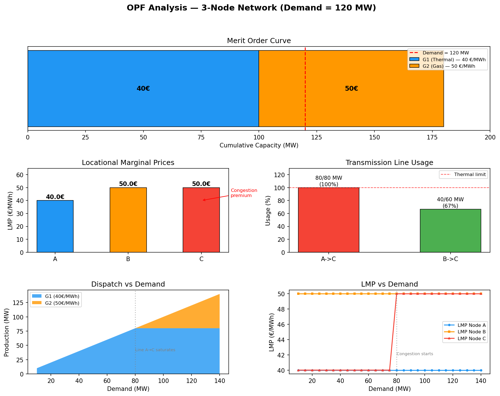

# Optimal Power Flow & Nodal Pricing Simulator

A 3-node power market simulator that solves the economic dispatch problem with transmission constraints and extracts **Locational Marginal Prices (LMP)** using linear programming duality.

## Objective

Electricity prices are not uniform across a power grid. When transmission lines are congested, consumers in constrained areas pay more because cheap generation cannot reach them. This project demonstrates this fundamental market mechanism by:

1. Solving a least-cost **economic dispatch** (minimizing total generation cost)
2. Enforcing **transmission constraints** (thermal line limits)
3. Extracting **nodal prices (LMPs)** from the dual variables of the optimization

## Network Topology

```
  Node A                                    Node C
  ┌──────────┐     Line A→C (80 MW)      ┌──────────┐
  │ G1       │─────────────────────────▶ │  Load    │
  │ 40 €/MWh │                           │ 120 MW   │
  │ 0-100 MW │                           │          │
  └──────────┘                           └──────────┘
                                              ▲
  Node B                                      │
  ┌──────────┐     Line B→C (60 MW)           │
  │ G2       │────────────────────────────────┘
  │ 50 €/MWh │
  │ 0-80 MW  │
  └──────────┘
```

- **G1 (Thermal)** at Node A: cheapest generator (40 €/MWh), but its output is limited by the 80 MW transmission line to Node C.
- **G2 (Gas)** at Node B: more expensive (50 €/MWh), connected to Node C via a 60 MW line.
- **Load** at Node C: 120 MW demand.

## Mathematical Formulation

The problem is formulated as a **Linear Program** with nodal power balance constraints:

```
Variables: x = [P_G1, P_G2, F_AC, F_BC]

Minimize    40·P_G1 + 50·P_G2

Subject to:
    P_G1 - F_AC         = 0         (Node A balance → dual = LMP_A)
    P_G2        - F_BC   = 0         (Node B balance → dual = LMP_B)
             F_AC + F_BC = Demand    (Node C balance → dual = LMP_C)
    F_AC ≤ 80                        (Line A→C thermal limit)
    F_BC ≤ 60                        (Line B→C thermal limit)
    0 ≤ P_G1 ≤ 100,  0 ≤ P_G2 ≤ 80
```

The key insight is that **each nodal balance constraint has a dual variable** (shadow price) that directly gives the LMP at that node — the cost of serving one additional MW of demand there.

## Results (Demand = 120 MW)

### Dispatch & Line Usage

| Generator | Node | Production | Cost    |
|-----------|------|-----------|---------|
| G1        | A    | 80 MW     | 40 €/MWh |
| G2        | B    | 40 MW     | 50 €/MWh |

| Line  | Flow   | Capacity | Usage |
|-------|--------|----------|-------|
| A→C   | 80 MW  | 80 MW    | 100%  |
| B→C   | 40 MW  | 60 MW    | 67%   |

G1 is dispatched first (cheapest), but is capped at 80 MW by the transmission line. G2 covers the remaining 40 MW.

### Locational Marginal Prices

| Node | LMP      | Interpretation |
|------|----------|----------------|
| A    | 40 €/MWh | Marginal cost = G1 (local generator) |
| B    | 50 €/MWh | Marginal cost = G2 (local generator) |
| C    | 50 €/MWh | Marginal unit is G2 (line A→C is full, extra MW must come from G2) |

The **congestion premium** at Node C is LMP_C - LMP_A = **10 €/MWh**. This is the price consumers pay because cheap energy from Node A cannot be fully delivered.

## Analysis



### Merit Order Curve (top)

Generators are stacked by ascending cost. The demand line (120 MW) cuts into G2's block, making G2 the **marginal unit** that sets the price at Node C.

### LMP Comparison (middle left)

The bar chart shows the price difference across nodes. The 10 €/MWh gap between Node A and Node C is the **congestion rent** — revenue captured by the transmission system operator (TSO).

### Line Usage (middle right)

Line A→C is at 100% capacity (red) — this is the binding constraint that creates the price separation. Line B→C has headroom at 67%.

### Sensitivity Analysis (bottom)

The most insightful charts:

- **Dispatch vs Demand**: below 80 MW, G1 alone serves all demand. Above 80 MW, G1 is capped and G2 ramps up linearly.
- **LMP vs Demand**: below 80 MW, all nodes see 40 €/MWh (no congestion). At exactly 80 MW, LMP at Node C **jumps** to 50 €/MWh as the line saturates. This step change is the signature of network congestion.

## Economic Interpretation

| Metric | Value |
|--------|-------|
| Total generation cost | 5,200 € |
| Consumer payment (120 MW × 50 €) | 6,000 € |
| **Congestion rent** | **800 €** |

The congestion rent (800 €) is the difference between what consumers pay and what generators receive. In real markets, this revenue goes to the TSO and can justify transmission expansion investments. If the A→C line capacity were increased to 120 MW, congestion would disappear, LMP_C would drop to 40 €/MWh, and consumers would save 1,200 €.

## Tech Stack

- **Python** with `scipy.optimize.linprog` (HiGHS solver)
- **NumPy** for matrix formulation
- **Pandas** for results display
- **Matplotlib** for visualization

## Usage

```bash
pip install -r requirements.txt

# Run the dispatch solver
python main.py

# Generate analysis graphs
python analysis.py
```

## Project Structure

```
├── opf_engine.py      # LP solver with nodal balance formulation
├── main.py            # Runs the 120 MW scenario and prints results
├── analysis.py        # Generates the 4-panel analysis figure
├── requirements.txt   # Dependencies
└── PROC.md            # Problem specification
```
